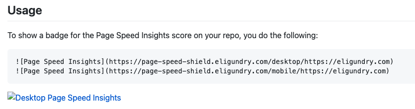
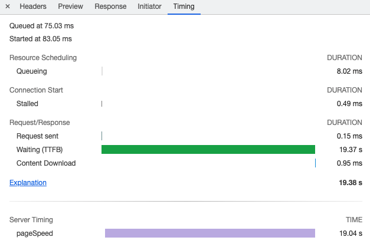

export { components } from '../../components/Post/components.astro'

As a software engineer, it's rare to have an idea for a personal project and actually finish it. We have ideas all the
time, buy domains for them, and then never finish them. For me, I've had a brain block for coding that isn't work for
like 5 years. _Well, maybe_ that isn't completely true, but for the purposes of this post, let's just roll with it.

At work, I've been working a lot with Gatsby on a new site. One of our big metrics that we are tracking with this new
site we are building is [Google Page Speed Insights](https://developers.google.com/speed/pagespeed/insights/). For those that don't know, Page Speed
Insights is a like a special version of [Google Lighthouse](https://developers.google.com/web/tools/lighthouse) that runs outside of Chrome's Dev Tools. It was
during one of these runs that I got an idea:

> What if I made a GitHub badge so that I can check on this passively?

I did some Googling and couldn't find any implementations of it and went to work.

# Implementation

[Page Speed Insights provides an API endpoint in the Go Google client][pagespeedonline] which is easy enough to use.
I went ahead are wired it into a [Gin HTTP server][gin] (I probably could have done this using the stdlib, but I like
Gin's routing and middlewares). After I ran the Page Speed test, I reverse proxied to [shields.io][shields.io], which is
a service that can generate GitHub shield badges.

This took me an evening and I was able to fetch a Page Speed badge using the following Markdown.

```markdown


```

Look at these badges!

Looks pretty snazzy, though it takes around 30 seconds to run, time to add it to a README!

# Results



Ah man, it failed to load! I did some Googling and it turns out that [GitHub proxies all images through their camo
service which has a 4 second timeout][camo-timeout]. This is good for the end user (prevents tracking pixels on GitHub
and images taking forever to load is bad UX), but terrible for my use case.

🤔 What if I cache it server side? The first Page Speed image load will take forever, but after that, we should be golden for
the cache lifetime. I added [Gin's caching middleware][gin-cache] and deployed. Sure enough, the first touch penalty was
around 30 seconds but after that it loaded instantly! **Unfortunately**, GitHub's camo proxy does it's own caching (so
that it can be on a CDN close to your geographic location) and it's impossible for the second image load to work as
outlined 😭.

# Conclusion

Even though this is an impossible project to get working as I envisioned, I'm really happy with how it turned out! The
[code][repo] is pretty "clean" (though that is subjective and I cringed saying that).

<GithubFile url="https://github.com/eligundry/page-speed-shield/blob/21b795baaaa3d02b24a7767456e1432dfeea9d5a/api/main.go" />

One really cool thing I found while building this was this [server timing Gin middleware][gin-server-timing] for writing
[`Server-Timing` headers][server-timing] to a response. This allowed me to see how long Page Speed Insights was taking
in the Chrome Dev Tools!



It's like having a mini-DataDog right in your browser!

[page-speed-insights]: https://developers.google.com/speed/pagespeed/insights/
[lighthouse]: https://developers.google.com/web/tools/lighthouse
[pagespeedonline]: https://pkg.go.dev/google.golang.org/api/pagespeedonline/v5
[gin]: https://github.com/gin-gonic/gin
[shields.io]: https://shields.io/
[camo-timeout]: https://github.com/badges/shields/issues/1568
[gin-cache]: https://github.com/gin-contrib/cache
[gin-server-timing]: https://github.com/p768lwy3/gin-server-timing
[server-timing]: https://developer.mozilla.org/en-US/docs/Web/HTTP/Headers/Server-Timing
[repo]: https://github.com/eligundry/page-speed-shield/
