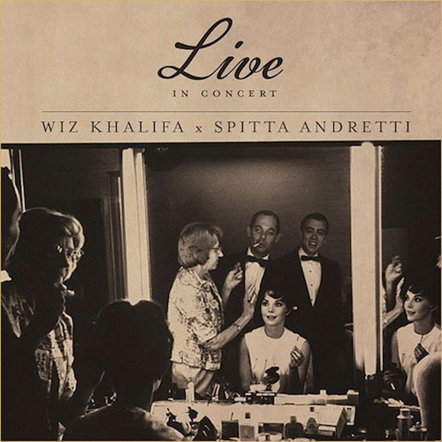

export { components } from '../../components/Post/components.astro'

This week, I'm gonna take us back to 2013. Happier times for sure. The album is
[_Live in Concert EP_ from Wiz Khalifa and Curren$y][1]. Don't be mislead, this
is not a live album, rather them doing their thing over jazz flutist [Bobbi Humphrey's album 1975 album _Fancy Dancer_][2].
While this isn't anybody's best album (Curren$y's best is [*Pilot Talk*][3],
Wiz's best is [*Kush & OJ*][4], and Humphry's is [*Blacks & Blues*][5]), but
this works great. The instrumentals are lush and engaging, the raps are about
women, weed, and cars, and the album doesn't overstay it's welcome at 23
minutes. The best track on it is [Landing][6], where there is an extended flute
solo at the end, Wiz does a lot with a simple verse, and Curren$y talks about
having in motion sensers in his house so girls can't snoop on him.

3.75/5

[1]: https://open.spotify.com/album/2r1pEm4zT8bzXy9zGKOLwe
[2]: https://open.spotify.com/album/1pT80BtTp6pzTvX3PFUHpb
[3]: https://open.spotify.com/album/5ydx8HEoTmJrxZuPKcTU4V
[4]: http://www.datpiff.com/Wiz-Khalifa-Kush-OJ-mixtape.112367.html
[5]: https://open.spotify.com/album/1zCeavwN7ZhPIGR5phKxJv
[6]: https://open.spotify.com/track/3GQsfS8DwxLPHWBBqFHOgI
