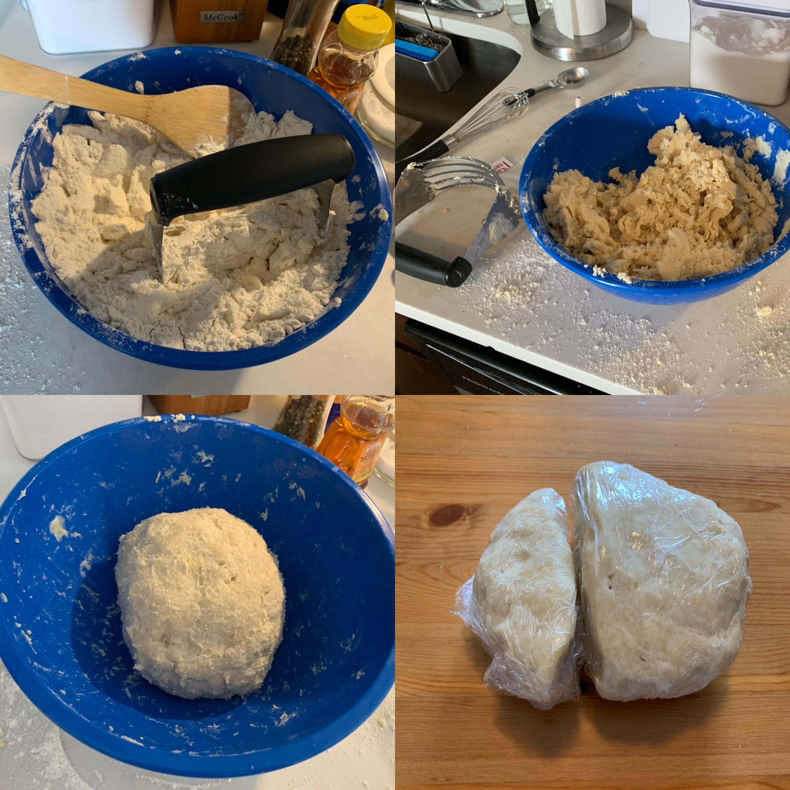
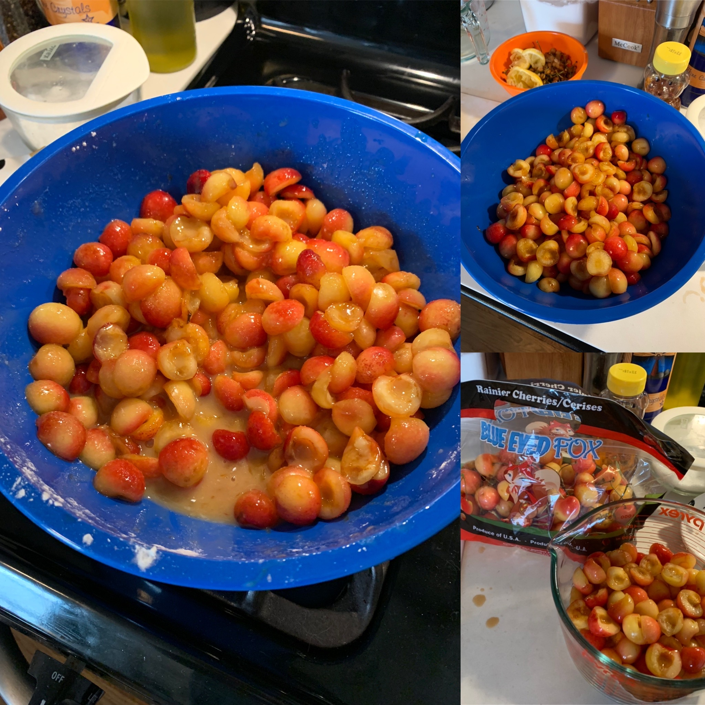
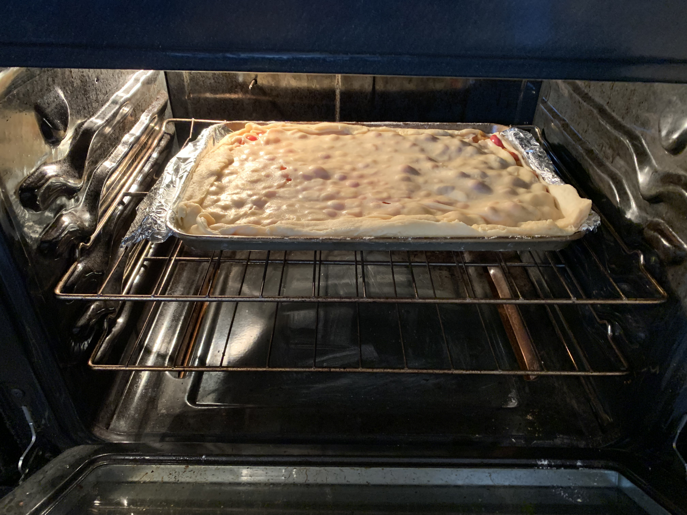
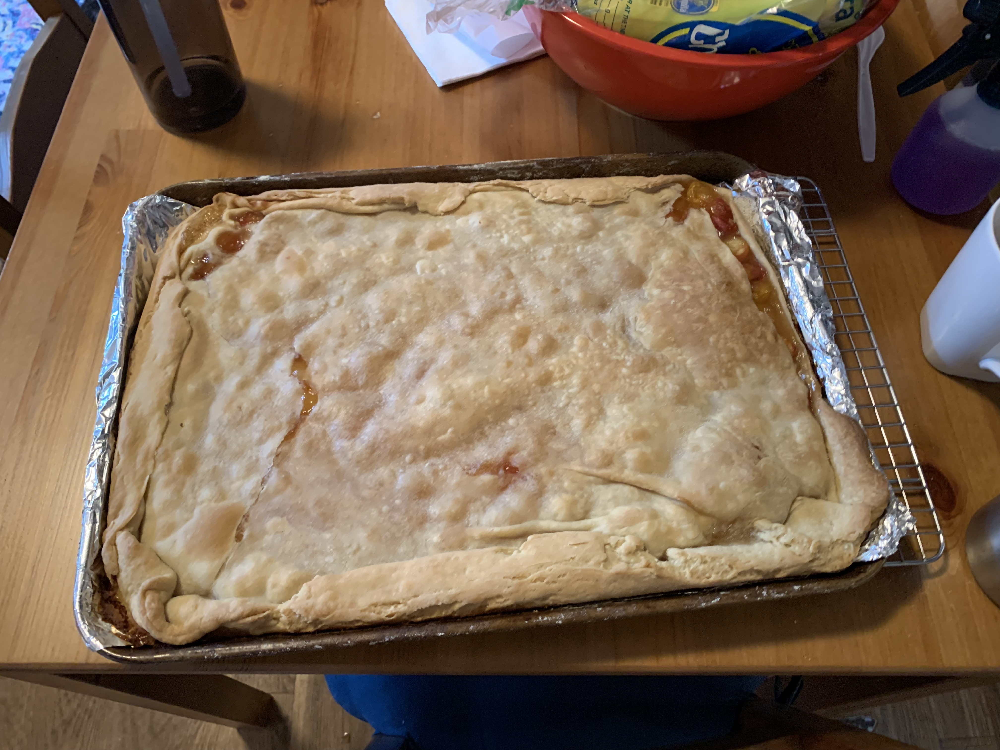
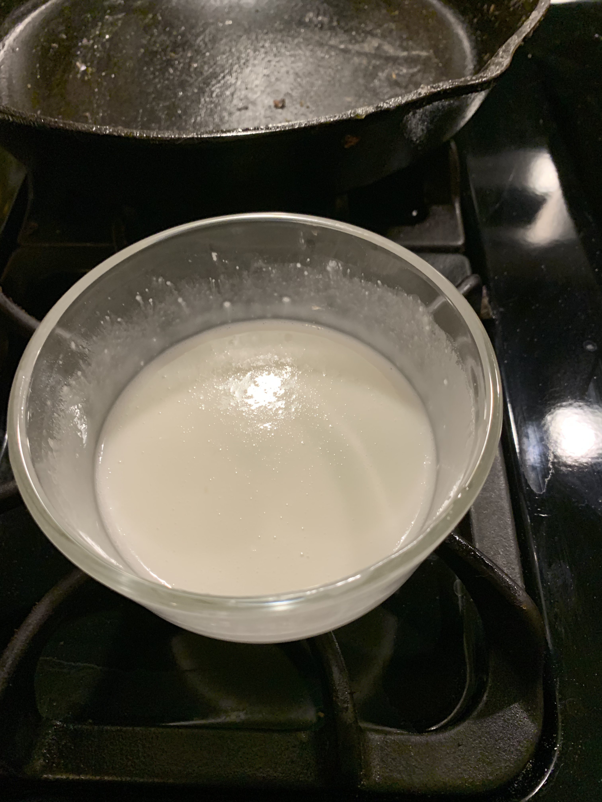
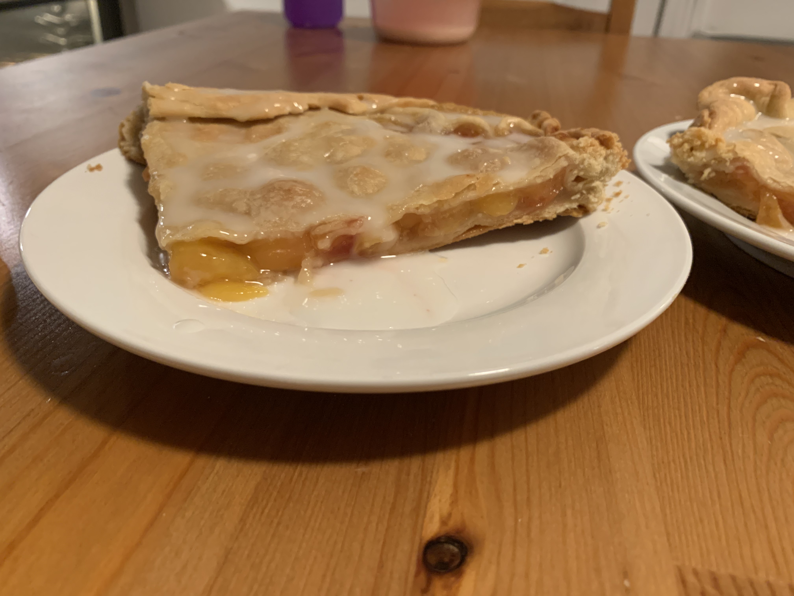
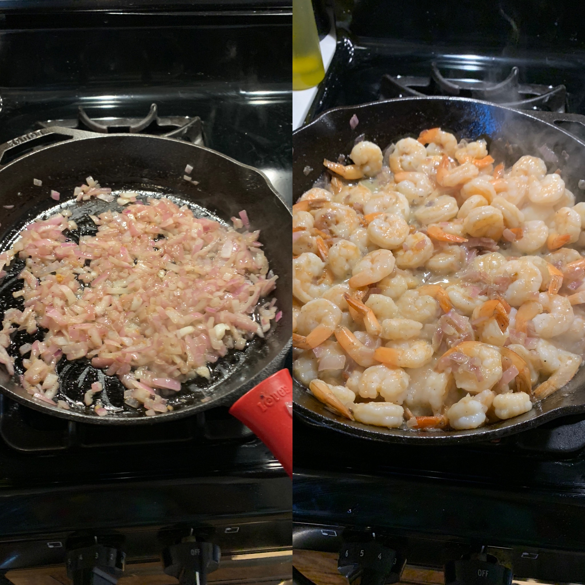
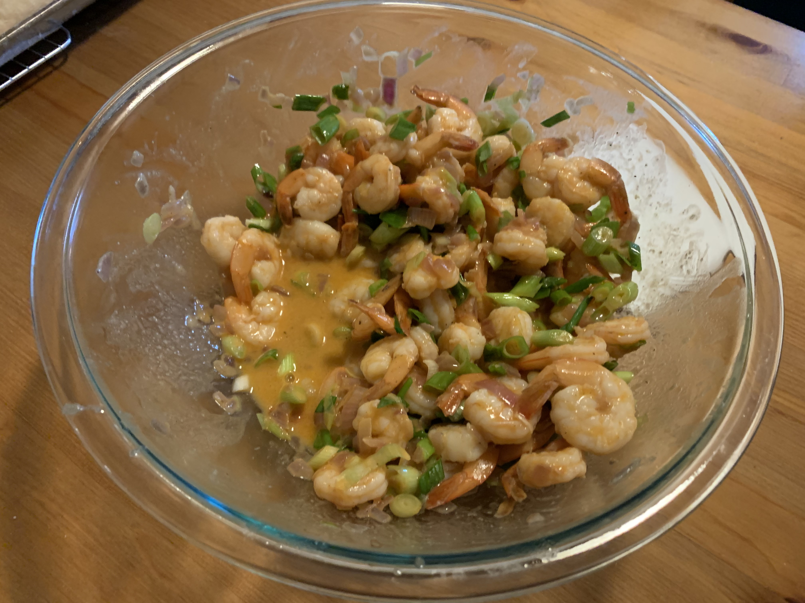
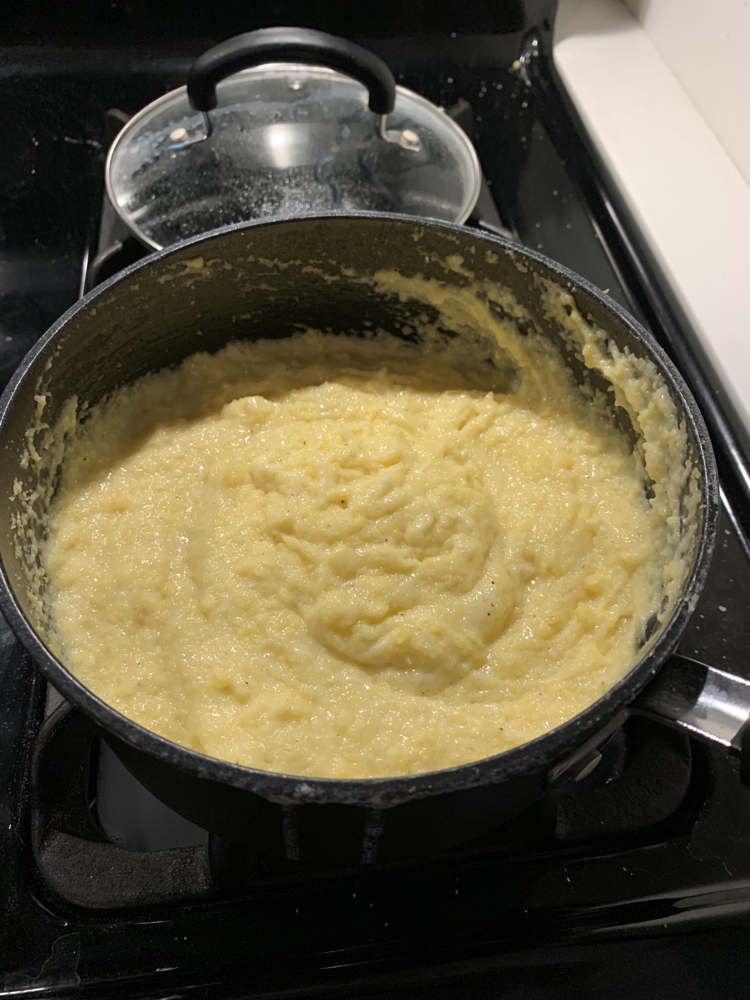
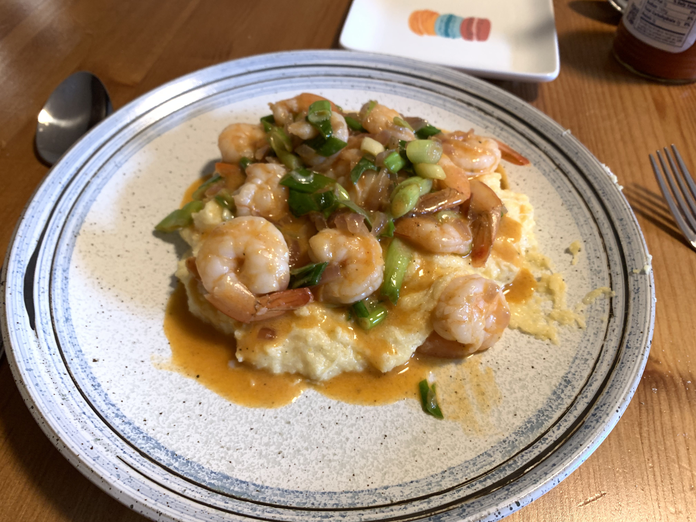

Last week was weird for me. The weekend before last, we booked social engagements every day of the weekend. While it was
nice that I went to the beach and saw friends, we didn't do our weekly grocery shopping. As a result, we ordered takeout
more than we should have and generally ate like 💩 .

This weekend though? Absolutely perfect! On Saturday, I took my partner to their first Mets game and it went swimmingly.
deGrom was pitching, the game was close, and there was a loud Philly fan in our section that was politely ribbing us
when a play went their way. The Mets were losing in the last inning before tying it up with bases loaded and then
winning the game on a walk off sacrifice fly. We even got a free shirt! Absolutely perfect Saturday!

The highlight of my weekend wasn't the game, though. At some point last week, a recipe for a cherry pie came across my
Twitter feed that **I had to make**. I cleared my schedule on Sunday and vowed to spend the day cooking. The results
speak for themselves, so let's dive in.

# [Cherry Slab Pie][cherry-slab-pie]

This recipe from the [Smitten Kitchen][smitten-kitchen] is what stopped me in my tracks. Now usually, I'm not a baker
because I feel that I lack the equipment. We don't have room for a stand mixer in our kitchen and doing mixing by hand
can be hard for recipes that call for a mixer. Which leads to what brought me to this recipe: the [pie
dough][pie-dough] calls for a [hand held pastry blender][pastry-blender] and not a stand mixer or food processor. I did
not have one and purchased it through the link on the page (you have to support Deb Perelman, so the affiliate link is
retained).

I got the flour and the ice cold butter in the bowl and started mashing. Senseless mashing wasn't working so I took
a deep breath and switched up the technique. Push and turn, push and turn, push and turn, be the stand mixer you want to
be. This was very Zen like, I must admit. I get why people like baking, it is calming. Before I knew it, I had the
butter blended pretty good and added some ice water and shaped into a ball. I sliced it a little bit (so I have enough
for the top crust), wrapped in plastic and tossed it in the fridge for 3 hours while I mopped the floor (it was so
nasty).

After I finished mopping, I figured I should prepare the cherries. The recipe called for sour cherries, but all the
grocery store I went to (Trade Fair) had were Rainier cherries. I've never seen baked good with Rainier cherries so
I just went with it. They aren't very sour, so I doubled the lemon juice I added. After I added the corn starch and
sugar, I sampled a few and got very excited as it was delicious.

As I was slicing the cherries, I was getting to the end of the current season of [_What Had Happened Was_ with Open Mike
Eagle][what-had-happened-was]. It's Open Mike Eagle interviewing an artist about their entire body of work over a whole
season. The first season was Price Paul of De La Soul & Handsome Boy Modeling school and it was great. This season was
El-P of Run the Jewels & Def Jux. I really liked this season because there is much to learn from a creative perspective
of how El-P looks at the world. I took away that you shouldn't try to force something to happen, take your time, and
live in the present instead of worrying about the future. Open Mike Eagle is one of my favorite live acts and I can't
wait for the world to open up enough for me to see him again.

Anyways, back to the pie. I spent like 30 minutes rolling out the ice cold pie dough so that it (barely) was the size of
the sheet pan I was going to bake the pie in. I was sore the next morning because I'm so out of shape but I really had
to put my back into it. I hastily assembled the pie and tossed it in the oven, forgetting to brush melted butter on it
(which I did after it cooked for like 45 mintues 🤦‍♂️ ). Next time I do a pie, I will put demerara sugar on the top
crust to get it a little extra crunch. Always room for improvement!

<figure>

<figcaption>I should have never smoked that shit now I have a giant Toaster Strudel</figcaption>
</figure>

I pulled the pie out as I started cooking dinner (more on that in a second) and it smelled delicious. This is my way of
saying that it's ugly as sin but I still love it. I set it aside to cool and we'd eat it after dinner.

Now it's time to make glaze for our giant Toaster Strudel! The recipe had three different preparation for the glaze: 

> 1 cup confectioners’ sugar
>
> 1 to 2 tablespoons milk or water or 1 tablespoon water plus 1 tablespoon lemon juice (I did this to make the glaze
> more interesting)

I decided to go with the lemon juice preparation. I relayed this to my partner along with the bit that Deb thought it
was "more interesting". This was met with my partner sarcastically commenting "Ohhh, Deb thinks it's interesting" to
which I cut her off and told her "I will not stand for Deb Perelman slander or disrespect in this house. She has posted
nearly a recipe a day for over a decade, what have you done!?". We love each other and this is our love language.

Well, after we sliced the pie and put the lemon glaze on and ate it. The lemon glaze on the pie was so good that my
partner had to retract her Deb Perelman slander and admit that it was interesting. The pie turned out great, even though
it was not the prettiest. The Rainer cherries look like cherry tomatoes, though, which makes the inside look cool. This
will be the summer of pies for Eli!

# [Hot Sauce Shrimp][hot-sauce-shrimp] + [Cheesy Polenta][cheesy-polenta]

[cherry-slab-pie]: https://smittenkitchen.com/2009/07/sour-cherry-slab-pie/
[hot-sauce-shrimp]: https://cooking.nytimes.com/recipes/1022328-hot-sauce-shrimp
[cheesy-polenta]: https://www.rachaelrayshow.com/recipes/rachaels-quick-cooking-cheesy-polenta
[smitten-kitchen]: https://smittenkitchen.com
[pie-dough]: https://smittenkitchen.com/2008/11/pie-crust-102-all-butter-really-flaky-pie-dough/  
[pastry-blender]: http://www.amazon.com/gp/product/B000QJE48O?ie=UTF8&tag=smitten-20&linkCode=as2&camp=1789&creative=390957&creativeASIN=B000QJE48O
[what-had-happened-was]: https://starburns.audio/podcasts/what-had-happened-was/
