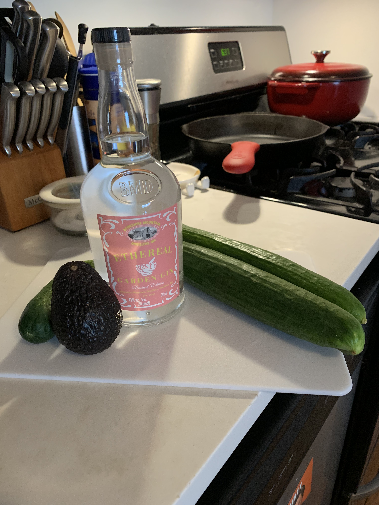
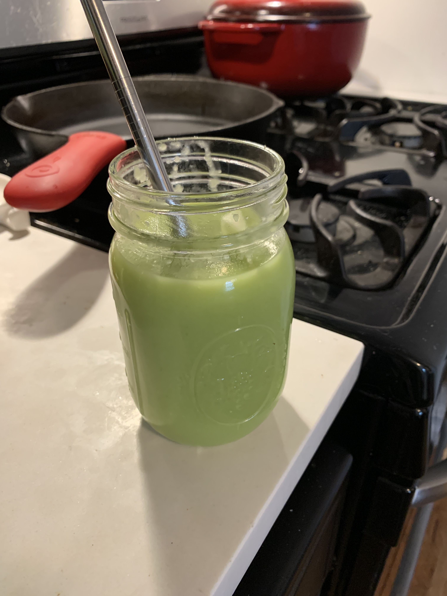

# [Strawberry Pretzel Pie][strawberry-pretzel-pie]

# [Spiked Cucumber Soup][cucumber-soup]

As you can tell, the color of my summer is green. I dyed my hair green, got a brand new Apple watch with a band to match
my hair color, and have bought clothes to complement it. Now, I'm not just eating green, but if I can make a dish to
match my theme, I'm going to do it.

Enter the [New York Times Spiked Cucumber Soup][cucumber-soup]. It's like a green juice, but with gin and it's actually a soup! Seemed
super easy to make so I decided to give it a shot.

My partner and I visited their parents in the Berkshires over Memorial Day weekend. On the last day there, we went to
a liquor tasting at [Berkshire Mountain Distillers][bmd]. We ended up purchasing one of their Etheral Garden gins that
had hints of horseradish because we keep it funky like that. Seemed like a great fit for this recipe.

I tossed all the ingredients in a blender and ran it until smooth.

**Verdict:** This is a very weird cocktail. I think our gin was a little stronger than the one in the recipe or the
recipe called for more cucumbers than we used. Either way, it was a little too strong BUT was still drinkable (by me, at
least, my partner is a lightweight 😂 ). I dunno if I would make it again.

[strawberry-pretzel-pie]: https://cooking.nytimes.com/recipes/1020323-strawberry-pretzel-pie
[cucumber-soup]: https://cooking.nytimes.com/recipes/1014750-spiked-cucumber-soup 
[bmd]: https://berkshiremountaindistillers.com/
