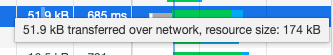
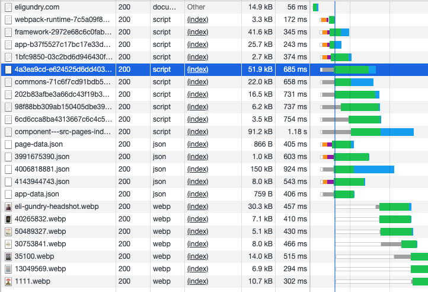
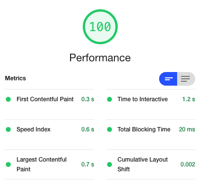
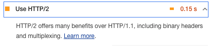
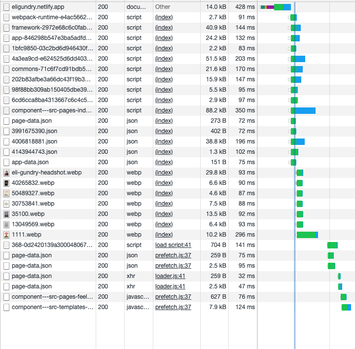

# Why?

[DigitalOcean Spaces][do-spaces] is an object storage service that is S3 compatible (you can use all the AWS S3
libraries, which is nifty) with a CDN automatically built in. It even lets you bring your own domain and it will handle
the SSL certificates for you through Let's Encrypt. Based upon my experience with Gatsby and S3, this seemed like
a great fit and since I'm already a DigitalOcean customer, I figured I might as well give it a shot instead of signing
up for another service.

Long story short, I was able to get it working, but I ended up ditching my plans for it to go with [Netlify][netlify].
Still, if you are here, you might have a do or die situation where you must host your site on Spaces and maybe this will
be useful.

## No Cloudfront or S3 Static Website Hosting Equivalent


* DO Spaces is like if S3 and Cloudfront were integrated, but not well
  * Based upon what I have read, DigitalOcean Spaces was the result of an acquisition of an acquisition and not something
    that DigitalOcean built in house. As a result, the quality is not what you would expect from DigitalOcean's other
    offerings.
  * Really seems optimized for like video hosting or blob storage for your application?
* It isn't built to serve static websites, so things like automatically routing to `index.html` don't work
* I attempted a solution of:
  * An nginx reverse proxy to do the URL rewriting that S3 Static Website hosting would do
  * Building the site with `--prefix-paths` to your CDN endpoint


```nginx
server {
    listen 443 ssl http2;

    # I have an API that I serve on the same domain and it must come 
    # first because of the rules that come after
    location ~ ^/api {
        proxy_pass http://api:8080;
    }

    # All these rules could probably be collapsed into one meta location.
    # I didn't have enough patience to really hammer that out, sue me.

    # All non html assets that are not on the CDN
    location / {
        resolver 1.1.1.1 [::1]:5353 valid=30s;
        set $cdn_url "https://cdn.eligundry.com/site/";
        proxy_pass $cdn_url;
        proxy_set_header Host "cdn.eligundry.com";
        # Without this, SSL handshakes fail?
        # https://stackoverflow.com/a/52199403
        proxy_ssl_server_name on;
    }

    # /index.html
    location = / {
        resolver 1.1.1.1 [::1]:5353 valid=30s;
        set $cdn_url "https://cdn.eligundry.com/site/";
        proxy_pass $cdn_url/index.html;
        proxy_set_header Host "cdn.eligundry.com";
        proxy_ssl_server_name on;
    }

    # All other HTML pages
    location ~ /(?<req_path>.+) {
        resolver 1.1.1.1 [::1]:5353 valid=30s;
        set $cdn_url "https://cdn.eligundry.com/site/";
        proxy_pass $cdn_url/$req_path/index.html;
        proxy_set_header Host "cdn.eligundry.com";
        proxy_ssl_server_name on;
    }
}
```

## No Automatic GZIP

If you want to get that sweet sweet 💯 from [Lighthouse][lighthouse], you need your content gzip'd. Unfortunately,
DigitalOcean Spaces' CDN  does not support gzip'ing on the fly like Cloudfront does, so you have to precompress your
assets as a part of your build. I used [`gatsby-plugin-zopfli`][gatsby-plugin-zopfli], which hooks into the Gatsby build
process to compress your assets, with the following config:

```javascript
{
  resolve: 'gatsby-plugin-zopfli',
  options: {
    extensions: ['css', 'js', 'html', 'json']
  }
}
```

This will compress all your assets while leaving the original files intact. In order for routing to work, you need to
overwrite the existing files with these compressed files. I used the following shell snippet in my deploy script.

```bash
$ for f in "public/*.gz"; do mv -v -- "$f" "${f%.gz}"; done 
```

A quick note on the above snippet: If you plan on having this in a CI pipeline and want to leverage 
[Gatsby incremental builds][gatsby-incremental-builds], this will break that, as it will be unable to detect if files
have changed or not. Such are the sacrifices we make for performance.

Finally, when you upload your files to DigitalOcean Spaces with `gatsby-plugin-s3`, you will need to manually set the
`Content-Encoding: gzip` header via the `params` option. It took me a little bit to understand how to do this so maybe
this will help you:

```javascript
{
  resolve: 'gatsby-plugin-s3',
  options: {
    mergeCachingParams: true,
    params: {
      '**/**': {
        ACL: 'public-read',
      },
      '**/**.js': {
        ContentEncoding: 'gzip',
      },
      '**/**.css': {
        ContentEncoding: 'gzip',
      },
      '**/**.html': {
        ContentEncoding: 'gzip',
      },
      '**/**.json': {
        ContentEncoding: 'gzip',
      },
    },
  },
}
```

With these settings, I was able to deploy my site! I opened my site, popped open up the network inspector to ensure
everything is gzip'd. I opened up a JS file and looked at the headers. Strange, there wasn't a `Content-Encoding: gzip`
header? Did this even work? I opened up the CDN console, purged the cache, redeployed 3 times (for luck), but still no
header. What am I doing wrong!?

I was doing nothing wrong. In the network panel, when I hovered over the request size, I saw that the transfer size
is smaller than the resource size, just like it would if it was gzip'd.



I did a little bit of Googling to figure out what's happening here and found this:

> Due to a known issue, file metadata headers like Content-Encoding are not passed through the CDN. Metadata headers are
> correctly set when fetching content directly from the origin.
>
> https://docs.digitalocean.com/products/spaces/how-to/set-file-metadata/

From what I can tell, the browser is treating this like gzip because of legacy quirks and is doing a content scan of the
file when it discovers it isn't actually a plain text `application/javascript` file. There is probably a trivial
performance hit here as it's harder than explicitly saying that it's a gzip'd file, but not enough to matter because
I have this site running!

## HTTP/2 Is Not Supported

Now that my site was live and somewhat functional, I started digging into the network tab to make sure everything is
order. I was greeted with this waterfall:



**Those highlighted gray bars are bad.** They are connections that are stalling because of too many other connections.
This is happening because [DigitalOcean Spaces does not support HTTP/2][do-spaces-no-http2]. [People have been voting on
adding this feature since 2018][pokemon-go-to-the-polls] and yet there is still no progress on this.

You can see how this is bad by how the grey bars become green as the bars starting with orange finish. For most web
browsers, [only six HTTP/1.1 connections can be made to the same host at once][6-http1-connections]. Before HTTP/2,
developers used to use CDNs that could provide multiple domains to side step this issue, but I really don't want to go
that route as it isn't 2011 anymore.

One of the big benefits to HTTP/2 is that this limit is removed and common connection things, like SSL handshakes, can
be shared between connections. **The fact that DigitalOcean Spaces does not support this in 2021 is going to prevent you
from getting the max score you could in Lighthouse.** With HTTP/3 around the corner, I am not optimistic in that getting
here anytime soon as well.

# Results



I was able to get a 100 from Lighthouse! But at what cost?



The site was still a little glitchy, I suspect because of the nginx routing I setup poorly and maybe some script loading
issues related to scripts sometimes loading out of order related to HTTP/1.1 restrictions.

I decided that this was too much work. As much as I love maintaining my own infrastructure and writing Github Actions,
this is a solved problem by [S3][s3], [Gatsby Cloud][gatsby-cloud], [Vercel][vercel], and [Netlify][netlify]. I've used Gatsby
Cloud and became frustrated with it (too "convention over configuration" for my tastes, though the build speeds are
fast). I'm using Vercel and S3 at work and they are pretty good, but just to round out the list, I decided to host my
site through Netlify.

## Netlify

Netlify was so easy to setup! I had my site running in about 10 minutes and I got a slightly better Lighthouse score
without any of the bugginess that I was seeing on DigitalOcean Spaces. And look at how much flatter and full of happy
colors this connection waterfall is (the time scale is roughly the same as the waterfall for DigitalOcean Spaces).



Also, how can you not enjoy their developer content!?

<blockquote class="twitter-tweet"><p lang="en" dir="ltr">Deploy serverless functions with a simple push ✨ <a href="https://t.co/p4k08cv4Q1">pic.twitter.com/p4k08cv4Q1</a></p>&mdash; Netlify (@Netlify) <a href="https://twitter.com/Netlify/status/1362440545604415493?ref_src=twsrc%5Etfw">February 18, 2021</a></blockquote>

# Conclusion

I still love DigitalOcean (I'm never leaving my cute Droplet for a soulless EC2 instance in Ohio), but I cannot
recommend DigitalOcean Spaces for static site hosting. For what it's worth, it doesn't appear that DigitalOcean
recommends it either. They have thousands of guides on how to do things, but none on hosting static sites here. Also,
there is this [support answer saying "good idea, maybe our product team will look at it?"][do-support-answer].

But, you should not use Spaces for anything related to static sites. It might be okay of simple object storage for an
app (which seems like their target use case).

[do-spaces]: https://www.digitalocean.com/products/spaces/
[lighthouse]: https://developers.google.com/web/tools/lighthouse
[gatsby-plugin-zopfli]: https://www.gatsbyjs.com/plugins/gatsby-plugin-zopfli/
[gatsby-incremental-builds]: https://www.gatsbyjs.com/docs/reference/release-notes/v3.0/#incremental-builds-in-oss
[do-support-answer]: https://www.digitalocean.com/community/questions/how-to-configure-a-static-website-from-a-do-space?answer=63554
[s3]: https://aws.amazon.com/s3/
[gatsby-cloud]: https://www.gatsbyjs.com/products/cloud/
[vercel]: https://vercel.com/
[netlify]: https://www.netlify.com/
[do-spaces-no-http2]: https://www.digitalocean.com/community/questions/spaces-cdn-http-2-support
[pokemon-go-to-the-polls]: https://www.digitalocean.com/community/questions/spaces-cdn-http-2-support
[6-http1-connections]: https://docs.pushtechnology.com/cloud/latest/manual/html/designguide/solution/support/connection_limitations.html
