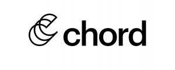

import { JobSearch2k22SankeyChart } from '../src/components/JobSearch/SankeyChart'

At the end of 2021, [I left my job at Talent Inc.][goodbye-talentinc] and conducted an extremely thorough job search.
I really prefer to job search without a day job so that I can give it my full focus. Today, I am happy to announce that
after a little over a month of interviewing, I found the perfect job for me. But, before I get to that, I really want to
talk about how I conducted my job search as it's been something I've been planning for a bit.

# [Numbers On The Board](https://www.youtube.com/watch?v=DawrlSwHUiM)

<JobSearch2k22SankeyChart />

This job market is wild! I can't tell if companies are hiring harder this cycle or if the fact that my last role was
"senior software engineer" at a startup or what. This cycle could not have gone any more different than my last job
search in 2017. 

Let's take a quick at conversion rates compared to 2017:

* Application → callback rate was 75% in 2022 vs 35% in 2017
* Application → code test rate was 40% in 2022 vs 9% in 2017
* Application → on site rate was 27% in 2022 vs 6% in 2017
* Application → offer rate was 19% in 2022 vs 1% in 2017

The numbers don't tell the full story here either! The later stage numbers here are weighed down by the fact that I was
able to drop out of processes later on if I wasn't getting good vibes from the company. That freedom alone allowed me to
have a little more swagger in walking into interviews.

# "Technology Enabled Job Search"

With working at a job focused on job seekers, I had four years to think about how I would approach my own job search.
A big one that I thought about was how to effectively track open rates of emails and my website. So, I went about wiring
my resume and email signature to append `utm` parameters to all the links to my website. My thought here was that
a click through to my site would lead to a more positive outcome on initial submission.

**This turned out to not work at all! I only got 3 visitors to the site from clicks in my email signature or resume
links.** Making unique copies of my resume and updating my signature on all my emails was seriously annoying, so this
definitely is not worth the effort. In fact, it may have subtly played against me as the checksum of my resume changed
on each job submission, which can throw off ATSs, like those used in Greenhouse. Finally, most of my processes went
through external recruiters so even if the user clicked through, I would have no idea which of the three companies they
submitted me to even clicked.

I did get elevated traffic to my website during my job search, though. It seems that I can attribute this increase from
the fact that I did post my last blog post on Linkedin right as my job search started. This post was brought up a few
times during interviews, which felt really good and gave the interviewer confidence in my writing skills. As they always
say, **content is king 👑**

# What Would I Do Differently?

**I spent too much time prepping for interview programming questions and not enough time asking what I actually want in my
next job.** This lead me to go deeper in processes that I knew that I was not going to take. I feel that, in all my
previous job searches, I was lucky to get what I get and not throw a fit. This search, people were thirsty for me and
I had to make hard decisions based upon feelings that I should have already talked out.

Another problem is that **I'm a people pleaser that's uncomfortable saying no**. This lead to me working with some… inept
recruiters this cycle that caused more headaches than what they were worth. In talking to some friends that are also
interviewing, I realized that their bullshit tolerance was much lower than mine and cut processes off if things felt
wrong or they were disrespected.

Finally, the last problem is that **I applied to way too many jobs**. I keep track of my progress during my job search in
a spreadsheet. I sent that spreadsheet to some of my friends and they were shocked by the number of places I started
processes with. In my defense, in past job searches, I have noticed that a lot of my applications go nowhere, which
I attribute to not having a degree and/or super interesting past positions. With that said, I had just too many
interviews back to back to back that I'm certain my performance in some of them was degraded by my lack of energy.

# Interviewers Say The Funniest Things

> "We love chaos here. We want just enough chaos to scare us to ship things fast, but not so much it paralyzes us."
>
> "We like to say that do things right the second time. We want that first time to ship fast."

Oh lord, I ran away from that company so fast. They had a wild code test that was closer to drive by than learning about
how I can benefit them.

> "So, your process of learning is just detective work?"

This was an interviewer's reply after I described, in detail, how I work in an unfamiliar and terrible codebase. It's
not super funny, but I had never heard it put that way before and I'm stealing it.

> "Our lead investor is [Scooter Braun](https://en.wikipedia.org/wiki/Taylor_Swift_masters_controversy)."

\#TeamTaylor until I die, ran away from that super fast.

> "The only downside is that product likes to live in the moment"

Never heard it put that way before, but product does be like that sometimes.

# Enough about the search! Where are you working!?

**I will be joining [Chord](https://chord.co) as a Staff Engineer in early February!**

I got seven offers and picking one was really hard, but also not hard at all. Out of all the places I interviewed, Chord
has the friendliest team that just "got me", if that makes any sense? There were no red flags that came up during the
interview, no one complained about how much the code needed to be fixed and everyone just seemed happy and competent.

Most importantly, what I'm going to be working on excites the heck out of me! Chord's vision is to bring ecommerce
tooling to statically generated sites. I love [static sites](/blog/2021-website-redesign) and selling things to
customers! I can't speak about specifics of what I'm going to be working on, but what excites me most about the work is
that they are doubling down on open up their frontend SDKs. I've never worked on libraries that other developers
use, so this will be an exciting challenge on top of all the feature work that needs to be done at a startup!

In closing, this has been a hectic job search and I'm so happy to finally be done with it. Now, I am going to take two
weeks off to be a human being. I'm probably going to go upstate for a long weekend. Definitely going to play some
tennis. Maybe I'll get lost in Central Park a few times or get another dumb tattoo.

[goodbye-talentinc]: /blog/what-i-learned-working-at-my-first-startup
