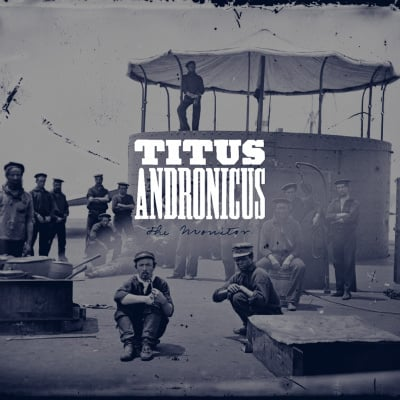

To honor the inauguration today, I'm going to talk about one of my favorite punk
albums of all time, [Titus Andronicus's _The Monitor_](https://open.spotify.com/album/5U09FQWagzAU5HPmufUAlU). This album is sort of
a concept album framed around the Civil War juxtaposed around a break up and
modern general anxiety.

Sonically, this album sounds awesome. The guitars are loud, but never overpower
the vocals and the riffs will remind you of Bruce Springsteen meets Civil War
marches meets traditional punk rock. This album will make you want to overtake
the means of production cause it rocks so hard. There are also softer songs,
like _To Old Friends And New_, which feels like a punk rock power ballad.

> So give me a Guinness, give me a Keystone Light
>
> Give me a kegger on a Friday night
>
> Give me anything but another year in exile

Let's talk about the concept of this album, because it's what makes this album
really special. The album opens with the lead singer's high school history
teacher reading a part from an Abraham Lincoln speech and then immeditely cuts
to the lead singer (Patrick Stickles) singing about moving from Jersey to
Massachusetts after a bad break up. Throughout the album, there are more Civil
War quotes that fit perfectly with the album. Using the backdrop of the war,
topics like relationships, addiction, and just general anxiety are explored.

> There will be parties, there will be fun
>
> There'll be tall gallows for everyone

This album benefits from repeated listens as well as following the albums lyrics
on [Genius][2]. This is because Stickles makes a lot of references that you
probably won't catch on the first listen (no joke, there is a Springsteen
reference followed by a Rakim quote in the first verse).

> The enemy is everywhere
>
> But no one seems to worried or care

My favorite part of this album involves the lyrics above. They first appear on
_Titus Andronicus Forever_, which is the second song, and it seems like
a throwaway punk song with a simple chorus. Then, a bunch of long sad songs
happen, and out of nowhere, this chorus repeats itself on _...And Ever_ with
added Springsteen-ish saxophone.

> This is a war we can't win
>
> After 10,000 years, it's still us against them
>
> And my heroes have always died at the end
>
> So who's going to account for these sins?

In closing, I don't like to get super political, but I would suggest diving into
this album with the headspace of the next 4-8 years being extremely regressive
with the government being run by people that are simultaneously corrupt and
incompetent. Yeah, get angry, listen to this album, and prepare for the war we
are about to fight.

- Standout Songs: _A More Perfect Union_, _Theme From "Cheers"_, _Four Score And Seven_, _...And Ever_
- Rating: 4 pieces of hardtack, some salted meats, and a handle of rye.

[1]: https://open.spotify.com/album/5U09FQWagzAU5HPmufUAlU
[2]: https://genius.com/albums/Titus-andronicus/The-monitor
[3]: /img/icymi/the-monitor.jpg
